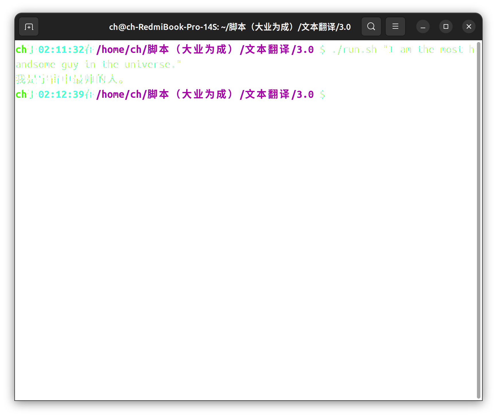

# 在终端里进行翻译

### 教程

1. 先去腾讯云里申请机器翻译的api（保护好，即使是免费的），放心是`免费`​的，不多说。把公钥，密钥分别填入main.c的16,17行的SECRET_ID，SECRET_KEY。
2. （可选）若翻译的原文不是英语，或者想得到的不是中文，就修改main.c的source_lang，target_lang，这个可以看看腾讯云的api文档，不愧是大厂，第一次见api文档这么详细的，还有测试的地方，还直接有不同语言的签名示例，🤙🏻。
3. 这时候就应该就可以直接运行

    ```bash
    ./run.sh "hello world!"
    ```

    就会输出

    ```txt
    你好！
    ```

‍

有兴趣的可以直接搞个快捷键

‍

###### 我的系统是ubuntu，若你的是别的，可以舍弃那个run.sh文件，用别的如vscode，clion等直接运行，第三方库得提前安装（不对，舍弃了sh文件输出的就是一个json内容，还是别舍弃了，windons有运行bash的方法，你找找）

‍

#### 演示



‍

## 遗憾

原本是想写一个翻译.h文档的脚本，但是最初整体的文件分工有问题，导致我想了好多写了好多，写了三个版本。还有linux命令也是恶心，也没个高质量的文档，就sed这个命令是每一次用都得看一遍，不过强大就是强大。就先这样吧，终端翻译也不错，文档的注释也是恶心人，都tm是英语。关于.h的文件注释一键翻译有时间在搞。
